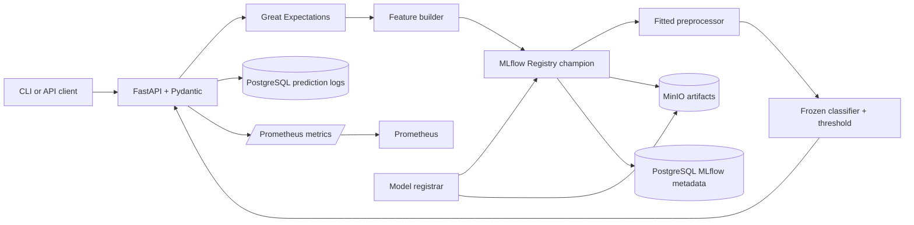

# Task 3 architecture

## Boundaries

- Training and evaluation remain in `notebooks/01` through `06`.
- `models/seed` is a small immutable release input for the one-time registrar. It is never
  loaded by the production API.
- The registrar packages the fitted preprocessor and classifier as one MLflow PyFunc model,
  records metrics/artifacts, creates a registry version, tags `stage=Production`, and moves
  the `champion` alias to it.
- The API resolves the alias from MLflow at startup. Failure to load it prevents the container
  from becoming healthy.
- Incoming data is typed by Pydantic, checked against the Great Expectations contract, and
  only then transformed with the already-fitted Notebook 05 object.
- PostgreSQL stores registry/run metadata and prediction events. MinIO stores binary MLflow
  and DVC objects. Prometheus scrapes the API metrics endpoint.

## Why these tools

FastAPI provides typed request/response schemas and automatic OpenAPI docs. Great
Expectations makes the runtime data rules executable. MLflow links parameters, metrics,
artifacts and the deployable registry version. DVC links Git revisions to data/artifact
content hashes. Docker Compose gives the database, registry, artifact storage, API and
monitoring a reproducible network and startup order. Pytest and Ruff give CI deterministic
quality gates.

